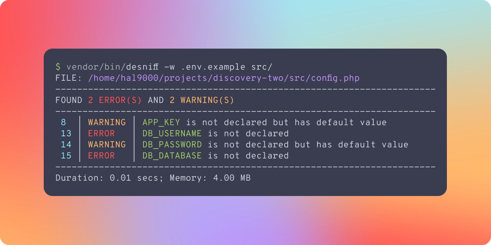

<div align="center">

# Dotenv Sniffer
A code sniffer for environment variables not declared in `.env` files




</div>

---

> :warning: This is project is very much a work in progress and your mileage may vary

## Requirements
The main system requirements are:
- [PHP](https://www.php.net/downloads) `^8.1`
- [Tokenizer extension](https://www.php.net/manual/en/book.tokenizer.php)

## Installation
```bash
composer require --dev backdevs/dotenv-sniffer
```

## Usage
```bash
vendor/bin/desniff .env.example ./config ./app
```

## Options and Arguments
Options
- `--no-fail` - Don't fail if errors are found (exit code = 0)
- `-w | --warn-with-default` - Treat variables with default values in [Laravel](https://laravel.com/)\'s [`env()`](https://laravel.com/docs/10.x/helpers#method-env) calls as warnings
- `-c | --fail-code` - The exit code to use when failing (default: 1), useful in CI/CD pipelines

Arguments
- `env-file` - The .env file to check against (e.g.: `.env`, `.env.example`, `.env.dev`)
- `paths` - One or more files and/or directories to check

## Quick Example
The `.env.example` file:
```dotenv
APP_NAME=DotenvSniffer

DB_HOST=localhost
```

The `config.php` file:
```php
<?php

use Illuminate\Support\Env;

return [
    'app' => [
        'name' => env('APP_NAME'),
        'key' => Env::get('APP_KEY', sprintf('base64:%s', base64_encode('example'))),
    ],

    'mysql' => [
        'host' => env('DB_HOST', 'localhost'),
        'username' => getenv('DB_USERNAME'),
        'password' => \Illuminate\Support\Env::get('DB_PASSWORD', 'secret'),
        'database' => $_ENV['DB_DATABASE'],
    ],
];
```

Output for `vendor/bin/desniff -w .env.example config.php`


